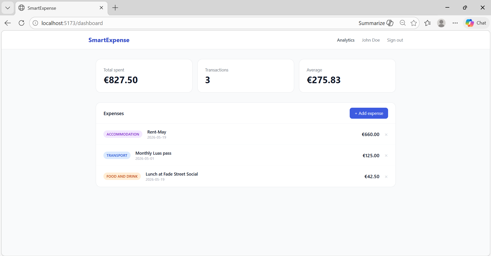
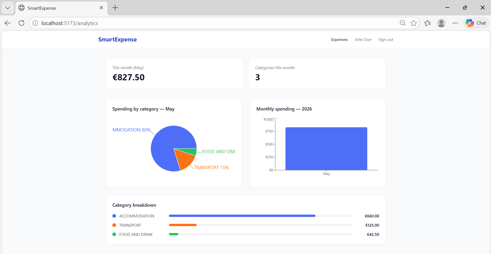

# 💸 Smart Expense Tracker

A production-grade personal finance application built with a microservices architecture. Track expenses, visualise spending patterns, and get real-time analytics — all powered by an event-driven backend.



## What it does

- **Track expenses** across categories like Food, Transport, Health, and more
- **Real-time analytics** — monthly spending breakdowns with charts
- **Budget alerts** — Kafka events fire when spending thresholds are crossed
- **Duplicate-safe** — idempotency keys prevent double-submissions on network retries
- **Secure** — JWT authentication, BCrypt password hashing, stateless sessions

## Tech Stack

**Backend** — Java 21 · Spring Boot 3.3 · Spring Security · Spring Cloud Gateway

**Messaging** — Apache Kafka (event-driven, async communication between services)

**Data** — PostgreSQL · Flyway migrations · Redis (idempotency + rate limiting)

**Frontend** — React 18 · TypeScript · Vite · TanStack Query · Recharts

**DevOps** — Docker · Docker Compose · GitHub Actions CI/CD · GitHub Container Registry

## Architecture

Five independent microservices, each with its own database:

Browser
│
▼
API Gateway (8085)          ← JWT validation, rate limiting, routing
│
├──▶ User Service (8081)       ← Registration, login, JWT issuance
├──▶ Expense Service (8082)    ← CRUD, Kafka producer, idempotency
└──▶ Analytics Service (8083)  ← Kafka consumer, spending aggregations
│
▼
Apache Kafka
│
├──▶ Analytics Service   ← updates monthly summaries
└──▶ Notification Service ← sends email confirmations

**Why Kafka?** When an expense is created, the expense service publishes an event. Analytics and notifications consume it independently — adding a new consumer requires zero changes to the producer.

## Key Engineering Patterns

**Idempotency keys** — Every `POST /expenses` request accepts an `Idempotency-Key` header. Duplicate requests (retries, double-clicks) return the original response without creating duplicate records. Standard practice in payment APIs.

**Database-per-service** — Each service owns its schema. No shared databases, no coupling. Services deploy independently.

**Manual Kafka acknowledgement** — Offsets only commit after successful processing. No message loss on consumer crashes.

**Cursor-based pagination** — Expense listing uses `createdAt` timestamp as cursor rather than offset pagination. Consistent performance at any dataset size.

**Flyway migrations** — Every schema change is a versioned SQL file committed to git. No manual `ALTER TABLE` in production.

## Running Locally

**Prerequisites:** Java 21, Docker Desktop, Maven 3.9+, Node.js 20+

**1. Start infrastructure**
```bash
docker compose up -d
```
Starts PostgreSQL (×3), Kafka, Redis, and Kafka UI at http://localhost:8090

**2. Start backend services** (each in its own terminal)
```bash
cd services/user-service && mvn spring-boot:run        # :8081
cd services/expense-service && mvn spring-boot:run     # :8082
cd services/analytics-service && mvn spring-boot:run   # :8083
cd services/notification-service && mvn spring-boot:run # :8084
cd services/api-gateway && mvn spring-boot:run         # :8085
```

**3. Start frontend**
```bash
cd frontend && npm install && npm run dev
```

Open http://localhost:5173

## API

POST   /api/v1/auth/register              Register
POST   /api/v1/auth/login                 Login → JWT
GET    /api/v1/auth/me                    Profile
POST   /api/v1/expenses                   Create expense
GET    /api/v1/expenses                   List (cursor pagination, filters)
PATCH  /api/v1/expenses/{id}              Update
DELETE /api/v1/expenses/{id}              Delete
GET    /api/v1/analytics/monthly/{y}/{m}  Monthly breakdown by category
GET    /api/v1/analytics/yearly/{year}    Full year overview

## CI/CD

Every push to `main` automatically:
1. Runs tests across all 4 backend services in parallel
2. Builds Docker images
3. Pushes to GitHub Container Registry (tagged with commit SHA)
4. Builds and type-checks the React frontend

## Screenshots

### Analytics
